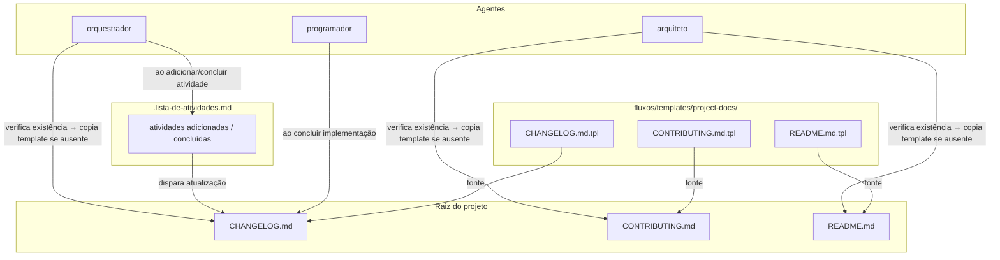

# Arquitetura — Gerenciamento Automático de Documentos do Projeto

## Visão Geral

## Componentes

| Componente | Tipo | Responsável | Trigger |
|---|---|---|---|
| `fluxos/templates/project-docs/CHANGELOG.md.tpl` | Template | arquiteto (criação) | n/a |
| `fluxos/templates/project-docs/CONTRIBUTING.md.tpl` | Template | arquiteto (criação) | n/a |
| `fluxos/templates/project-docs/README.md.tpl` | Template | arquiteto (criação) | n/a |
| `CHANGELOG.md` | Documento vivo | orquestrador, programador | início de sessão + atividades |
| `CONTRIBUTING.md` | Documento vivo | arquiteto | início de sessão |
| `README.md` | Documento vivo | arquiteto | início de sessão |
| `.claude/agents/orquestrador.md` | Agente (modificado) | — | ao adicionar/concluir atividades |
| `.claude/agents/arquiteto.md` | Agente (modificado) | — | ao iniciar trabalho de arquitetura |
| `.claude/agents/programador.md` | Agente (modificado) | — | ao concluir implementação |

## Fluxo de verificação e criação

1. Agente aciona verificação: `if [ ! -f <arquivo>.md ]`
2. Se ausente: copia o template correspondente de `fluxos/templates/project-docs/`
3. Se presente: não sobrescreve — apenas atualiza seções específicas (ex: CHANGELOG)

## Fluxo de atualização do CHANGELOG

1. `orquestrador` adiciona atividade a `.lista-de-atividades.md` → adiciona entrada `[Unreleased]` no `CHANGELOG.md`
2. `orquestrador` marca atividade como `concluída` → move entrada para seção de data corrente
3. `programador` conclui implementação → adiciona entrada `Added`/`Changed`/`Fixed` ao `CHANGELOG.md`
